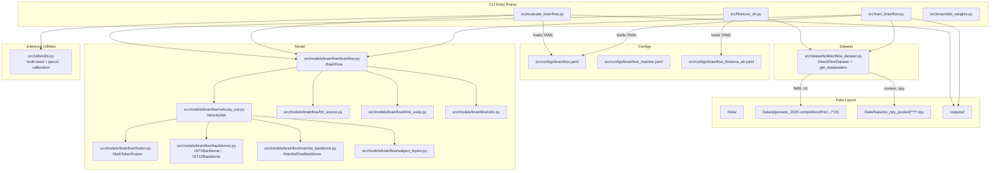

# CODEBASE_KNOWLEDGE — BrainFlow (Algonauts 2025)

This document is a “brain dump” of the repo at a specific point in time, intended to help another LLM (or engineer) implement features, fix bugs, and refactor safely.

**Scope (what this covers)**
- The active training/evaluation/inference stack centered on BrainFlow (seq2seq flow-matching model).
- Data layout assumptions for Algonauts 2025 competitor dataset and pre-extracted context features.
- Where to change things safely (configs, dataset, model, evaluation strategies).

**Out of scope (what is present but not the main runtime path)**
- The bundled baseline / reference code under `src/models/algonauts-2025/` and `src/models/challenge_baseline_model/` is largely not wired into the BrainFlow entrypoints.

---

## STATE BLOCK (Global)
- Phase 1–6: COMPLETE
- Primary runtime entrypoints identified and read
- Model/dataset/config relationships mapped
- Known gotchas recorded (including a likely broken inference strategy path)

---

# PHASE 1 — Initial Context Scan

## 1.1 What this application is
This repository is an ML system for the **Algonauts 2025 challenge**: predicting fMRI responses (1000 Schaefer parcels, 7-network atlas) from **pre-extracted multimodal stimulus features**. The main approach is **seq2seq flow matching**: it takes a long context window of stimulus features (e.g. 101 TRs) and generates a shorter window of fMRI time series (e.g. 50 TRs).

**Primary users**
- Competitors training models and generating `submission.zip` for the challenge.

## 1.2 Main features (business purpose → technical feature)

1) **Train BrainFlow models**
- Business purpose: learn a multimodal mapping to brain signals that maximizes correlation on validation sessions.
- Technical: `src/train_brainflow.py` trains `src/models/brainflow/brainflow.py:BrainFlow` using data from `src/datasets/directflow_dataset.py` and YAML hyperparameters.

2) **Evaluate on S6 and create blind submissions for S7 + OOD**
- Business purpose: measure progress locally (S6 PCC) and generate the required submission artifact for the challenge.
- Technical: `src/evaluate_brainflow.py` runs inference windowing + overlap-averaging and emits `outputs/submissions/<run_name>/{s7|ood}/submission.zip`.

3) **Finetune on S6 only**
- Business purpose: squeeze extra performance by adapting a trained model using S6 as training data.
- Technical: `src/finetune_s6.py` trains only on the `friends:s6` split and periodically saves checkpoints.

4) **Ensemble checkpoints (model soup / weight averaging)**
- Business purpose: improve generalization by averaging multiple nearby checkpoints.
- Technical: `src/ensemble_weights.py` averages state_dict weights and saves a single checkpoint.

## 1.3 Tech stack and dependencies
- Python + PyTorch (`torch`, `torchvision`) for model training/inference.
- `numpy`, `h5py` for data I/O.
- `yaml` (PyYAML) for configs.
- `tqdm` for progress.

The official competitor environment dependencies are listed in `Data/algonauts_2025.competitors/requirements.txt`.

## 1.4 High-level structure
- `src/` — active model + training/eval code.
  - `src/train_brainflow.py`, `src/evaluate_brainflow.py`, `src/finetune_s6.py` — main CLIs.
  - `src/configs/*.yaml` — model/data/training configs.
  - `src/datasets/directflow_dataset.py` — dataset loading and windowing.
  - `src/models/brainflow/*` — BrainFlow model implementation.
  - `src/utils/utils.py` — inference-time strategy utilities (multi-seed / parcel-stitch / pruned sampling).
- `Data/` — dataset + extracted features + docs.
- `outputs/` — training runs and checkpoints.
- `scripts/` — helper scripts (not always aligned with current model versions).

## STATE BLOCK (Phase 1)
- Repo purpose understood (Algonauts 2025 fMRI prediction)
- Main runtime entrypoints confirmed
- Next: map full architecture/dataflow and then feature-by-feature

---

# PHASE 2 — System Architecture Deep Dive

## 2.1 End-to-end dataflow

### Training flow (online)
1) YAML config is loaded (default `src/configs/brainflow.yaml`).
   - Loader: `src/datasets/directflow_dataset.py:load_config` (used by training/eval/finetune).
   - Path resolver: `src/train_brainflow.py:resolve_paths`.
2) Dataset is built and **fully preloaded into RAM**.
   - Dataset: `src/datasets/directflow_dataset.py:DirectFlowDataset`.
   - It loads:
     - fMRI from `Data/algonauts_2025.competitors/fmri/<sub>/func/*.h5`
     - features from multiple `Data/features_npy_pooled/<modality>/**/*.npy` directories.
3) Model is built:
   - `src/models/brainflow/brainflow.py:BrainFlow`
   - Internally uses `src/models/brainflow/velocity_net.py:VelocityNet`.
4) Training loop performs flow-matching loss and optional CSFM auxiliary terms.
   - Training loop: `src/train_brainflow.py:train`.
5) Output artifacts are written to `outputs/<run_name>/`.
   - `best.pt`: best EMA-applied state_dict (saved as plain state_dict).
   - `last.pt`: full checkpoint dict including optimizer/scheduler/EMA shadow.

### Evaluation/submission flow
1) Loads YAML config and builds model in `src/evaluate_brainflow.py:ModelRunner`.
2) Loads checkpoint (priority: `--checkpoint` override → `best.pt` → EMA from `last.pt`).
   - Loader: `ModelRunner.load_checkpoint`.
3) Builds sliding windows from context clips, runs ODE inference per window, and overlap-averages.
   - Window builders: `build_seq2seq_windows`, `build_s7_windows`.
   - Batched inference: `ModelRunner.run_windows`.
4) For S6: computes per-voxel PCC and saves metrics under `{output_dir}/eval_s6/`.
5) For S7/OOD: saves per-subject temporary files then assembles `submission.npy` and zips it.
   - `_save_submission`.

## 2.2 Component map

**Entrypoints**
- Training: `src/train_brainflow.py`
- Evaluation/submission: `src/evaluate_brainflow.py`
- Finetune: `src/finetune_s6.py`
- Weight ensembling: `src/ensemble_weights.py`

**Core modules**
- Dataset: `src/datasets/directflow_dataset.py`
- Model: `src/models/brainflow/brainflow.py` + `src/models/brainflow/velocity_net.py`
- Fusion: `src/models/brainflow/fusion.py`
- Backbones: `src/models/brainflow/backbones.py`, `src/models/brainflow/mamba_backbone.py`
- Subject output heads: `src/models/brainflow/subject_layers.py`
- Flow helpers: `src/models/brainflow/utils.py`
- Inference strategies: `src/utils/utils.py`

**Architecture diagrams**
- Overall architecture: `codebase-analysis-docs/assets/ARCHITECTURE.mmd`
- Model internals flow: `codebase-analysis-docs/assets/MODEL_FLOW.mmd`

Preview (overall architecture):



Preview (model flow):

```mermaid
flowchart LR
  C[Context: (B,T_ctx,D_total)
concatenated modalities] --> E[VelocityNet.encode_context_from_cond]
  subgraph Encode[Context Encoding]
    E --> F[MultiTokenFusion: per-modality proj + concat/mean]
    F --> TEnc[Temporal encoder
(RoPE Transformer layers or nn.TransformerEncoder)]
    TEnc --> Slice[Center slice to n_target_trs tokens]
  end

  subgraph Flow[Flow Matching Branch]
    X0[x0: start (noise or CSFM source)] --> XT[x_t: interpolate with t]
    XT --> VPred[VelocityNet.forward
(backbone + subject head)]
    VPred --> Lflow[flow_loss = MSE(v_pred, target_velocity)]
  end

  subgraph CSFM[Optional CSFM Source]
    TEnc --> HRF[AECNN_HRF_Source
(mu_phi, sigma_phi)]
    HRF --> X0
    HRF --> Lpcc[PCC loss]
    HRF --> Lvar[Variance reg]
  end

  subgraph TensorFM[Optional Tensor-FM]
    TEnc --> Gamma[TimeWarpNet predicts gamma]
    Gamma --> Sched[tensor_warp_schedule
(lambda_t, d_lambda_t)]
    Sched --> XT
  end

  E -->|context_encoded| XT
  E -->|context_encoded| VPred
  Lflow --> Ltot[total_loss]
  Lpcc --> Ltot
  Lvar --> Ltot
```

## STATE BLOCK (Phase 2)
- Major components and interactions mapped
- Next: feature-by-feature analysis (training, evaluation, finetune, ensembling, data utilities)

---

# PHASE 3 — Feature-by-Feature Analysis

## 3.1 Feature: Training (BrainFlow)

**Business purpose**
- Train a model that predicts fMRI time-series windows from multimodal context, improving S6 PCC.

**Entry point**
- `src/train_brainflow.py` (CLI args: `--config`, `--resume`, `--warmstart`, `--fast_dev_run`, batch overrides).

**Key technical steps**

### 3.1.1 Config resolution
- `resolve_paths(cfg, PROJECT_ROOT)` injects:
  - `cfg["_data_root"]`
  - `cfg["_fmri_dir"]`

### 3.1.2 Dataset creation
- `get_dataloaders(cfg)` in `src/datasets/directflow_dataset.py`.
  - Train uses `ClipGroupedBatchSampler` to keep windows from the same clip grouped (reduces variance in batch composition).
  - Validation uses a normal sequential loader.

**DirectFlowDataset behavior**
- Preloads all context and fMRI into RAM during `__init__`.
- Seq2seq mode is selected when `cfg["sliding_window"]["n_target_trs"]` exists.
  - Returns:
    - `context`: `(context_trs, D_total)` (e.g. 101 × sum(modality_dims))
    - `fmri`: `(n_target_trs, V)` (e.g. 50 × 1000)
    - plus metadata (`clip_key`, `subject_idx`, `target_tr_start`, `n_trs`).
- HRF alignment:
  - fMRI windows start at `target_tr_start`.
  - Feature window center is shifted by `hrf_delay` and corrected for `excluded_samples_start`.
  - See `DirectFlowDataset.__getitem__`.

### 3.1.3 Model build
- Built in `src/train_brainflow.py` as:
  - `BrainFlow(output_dim, velocity_net_params, n_subjects, ... flags ...)`

Important config keys (from `src/configs/brainflow.yaml`)
- `context_latent_dirs`: list of feature roots.
- `modality_dims`: dimension per modality (must match the feature arrays).
- `sliding_window.context_trs`, `sliding_window.n_target_trs`, `sliding_window.stride`.
- `brainflow.velocity_net.decoder_type`: `ditx` (default), `dit1d`, or `mamba`.
- `brainflow.use_csfm`: enables HRF-based source distribution and auxiliary losses.
- `solver_args`: inference-time settings reused in validation synthesis.

### 3.1.4 Losses and optimization
- Core training call: `BrainFlow.compute_loss(context, target, subject_ids, skip_aux=cfg_drop)`.
- The training loop uses a simple **classifier-free guidance style** dropout:
  - With probability 0.1: `context = zeros_like(context)` and `skip_aux=True`.
  - This trains an unconditional branch for CFG at inference (`cfg_scale > 0`).
  - See `src/train_brainflow.py`.

Optimization details
- Optimizer: AdamW.
- Scheduler: cosine with warmup (custom LambdaLR).
- Gradient accumulation: `training.gradient_accumulation_steps`.
- EMA: `EMAModel` stored on CPU by default for VRAM savings.

### 3.1.5 Validation
- Every `val_every_n_epochs`, applies EMA shadow weights and synthesises fMRI via ODE.
- Aggregates overlap windows and computes mean per-voxel PCC.

**Outputs**
- `outputs/<run>/config.yaml` (copied from CLI config)
- `outputs/<run>/history.csv`
- `outputs/<run>/best.pt` (state_dict)
- `outputs/<run>/last.pt` (full checkpoint dict with EMA)

---

## 3.2 Feature: Evaluation + Submission

**Business purpose**
- S6: compute PCC vs ground truth.
- S7/OOD: generate blind submission zip.

**Entry point**
- `src/evaluate_brainflow.py`.

**Key technical pieces**

### 3.2.1 ModelRunner abstraction
- `ModelRunner` isolates model instantiation and checkpoint loading.
- If the model changes, you should modify `ModelRunner._build()` and how `synthesise()` is called.

### 3.2.2 Context loading logic
- `load_context_clip(context_dirs, task, session, clip_name, expected_dims)` loads per-modality `.npy` and concatenates.
- It attempts multiple filename candidates and zero-fills missing modalities.

### 3.2.3 Windowing
- S6 uses `build_seq2seq_windows(...)` which applies `excl_start` when mapping fMRI TR to feature time.
- S7/OOD uses `build_s7_windows(...)` without `excl_start` (no ground-truth trimming requirement).

### 3.2.4 Multi-seed strategies (Strategy-4)
- Implemented in `src/utils/utils.py:run_multiseed_synthesis`.
- Supported `ensemble_mode`:
  - `none` / `single`: 1 seed
  - `mean`: mean across seeds
  - `max`: elementwise max across seeds
  - `parcel_stitch`: choose per-voxel seed index using an S6-derived calibration artifact

Calibration artifact
- Saved during S6 evaluation when `ensemble_mode==parcel_stitch` and `n_seeds>1`.
- Path helper: `calibration_path(output_dir)`.

### 3.2.5 Submission format
- For S7 and OOD, writes a temporary `{subj}_predictions.npy` containing dicts.
- `_save_submission` merges into `submission.npy` and zips as `submission.zip`.

---

## 3.3 Feature: Finetune on S6 only

**Business purpose**
- Adapt a pretrained model specifically to Friends S6.

**Entry point**
- `src/finetune_s6.py`.

**Key behaviors**
- Loads a checkpoint strictly (`strict=True`).
- Trains on a train-only DataLoader over `splits.friends.train: [s6]`.
- Periodically saves checkpoints (config key `training.save_every`).

---

## 3.4 Feature: Weight ensembling

**Business purpose**
- Improve performance by averaging checkpoints.

**Entry point**
- `src/ensemble_weights.py`.

**Behavior**
- Loads each checkpoint, extracts `ckpt.get("model", ckpt)`.
- Sums weights in float32 and divides by N.

---

## 3.5 Feature: Data download + legacy datasets (secondary)

- `Data/data/download_data.py` downloads the competitor dataset via DataLad.
- `Data/data/dataset.py` defines a separate sliding-window dataset and feature loaders.
  - This appears to belong to an earlier baseline pipeline and is not used by `src/train_brainflow.py`.

## STATE BLOCK (Phase 3)
- Feature-level behavior documented for training/eval/finetune/ensemble
- Next: capture nuanced gotchas, performance issues, and non-obvious design decisions

---

# PHASE 4 — Nuances, Subtleties & Gotchas

## 4.1 Seq2seq context slicing is central and easy to misunderstand
- `VelocityNet.encode_context_from_cond` always **center-slices** the temporally-encoded context to exactly `n_target_trs` tokens:
  - `slice_start = (context_trs - n_target_trs) // 2`
  - output context tokens become `(B, n_target_trs, hidden_dim)`.
- This matches the decoder’s target token axis and enables per-TR alignment.

Implication
- Even though the dataset provides `context_trs` tokens (e.g. 101), the model’s decoder only receives `n_target_trs` (e.g. 50) after slicing.

Files
- `src/models/brainflow/velocity_net.py:VelocityNet.encode_context_from_cond`

## 4.2 Context encoder “flat” mode is not supported
- `VelocityNet.__init__` enforces `context_encoder == "multitoken"` and raises otherwise.
- Any older scripts/configs referencing `flat` need updating.

Files
- `src/models/brainflow/velocity_net.py:VelocityNet.__init__`

## 4.3 Inference strategy “pruned sampling” likely broken in current code
- `src/utils/utils.py:build_regression_anchor` calls `model.reg_head` and `model.reg_output`.
- The current `BrainFlow` implementation in `src/models/brainflow/brainflow.py` does **not** define these modules.

Impact
- If `--use_pruned_sampling` is enabled in `src/evaluate_brainflow.py`, the call path:
  - `run_multiseed_synthesis` → `build_pruned_starting_distribution` → `build_regression_anchor`
  will likely raise `AttributeError: 'BrainFlow' object has no attribute 'reg_head'`.

Mitigations
- Avoid `--use_pruned_sampling` until `build_regression_anchor` is updated to match the current model.
- Or reintroduce the regression head modules to `BrainFlow` if desired.

Files
- `src/utils/utils.py`
- `src/evaluate_brainflow.py` (CLI flag wiring)

## 4.4 EMA checkpoint formats differ across tools
- `train_brainflow.py` saves:
  - `best.pt` as plain `state_dict`.
  - `last.pt` as a dict with keys including `model` and `ema`.
- `evaluate_brainflow.py` handles both and can apply EMA shadow from `last.pt`.
- `finetune_s6.py` loads a checkpoint with `ckpt.get("model", ckpt)` and then `strict=True`.

Potential pitfall
- Passing a `last.pt` from training into `finetune_s6.py` works (it uses `ckpt.get("model", ckpt)`), but strict loading means the architecture must match exactly.

## 4.5 Memory profile: dataset preloads everything
- `DirectFlowDataset` preloads all clips into RAM (context + fMRI).
- With many modalities and long clips, this can be tens of GB.

Files
- `src/datasets/directflow_dataset.py:DirectFlowDataset._build_index_and_preload`

## 4.6 CSFM adds an HRF-based source distribution and extra losses
- When `brainflow.use_csfm: true`, `BrainFlow.compute_loss`:
  - Builds `x_0` from `AECNN_HRF_Source` + subject head.
  - Adds variance regularization and PCC loss.

Files
- `src/models/brainflow/brainflow.py` (CSFM logic)
- `src/models/brainflow/hrf_source.py`

## 4.7 CFG training mechanism is simplistic but important
- Training randomly zeroes the entire context with probability 0.1.
- Regression/aux losses are skipped for those unconditional examples.

Files
- `src/train_brainflow.py` (CFG dropout)
- `src/models/brainflow/brainflow.py:synthesise` (CFG guidance)

## STATE BLOCK (Phase 4)
- Major gotchas captured (pruned sampling mismatch, slicing, preload RAM)
- Next: build a technical reference & glossary for common terms and important symbols

---

# PHASE 5 — Technical Reference & Glossary

## 5.1 Glossary
- **TR**: repetition time index (fMRI time step).
- **context_trs**: number of TR tokens the encoder sees from context (e.g. 101).
- **n_target_trs**: number of TR tokens to predict (e.g. 50).
- **PCC**: Pearson correlation coefficient; used as primary metric.
- **CFG**: classifier-free guidance; implemented by training with context dropped to zeros.
- **Flow Matching**: training objective comparing predicted velocity to target velocity along a path from $x_0$ to $x_1$.
- **InDI**: a flow matching variant where the model predicts a residual scaled by $(1-t)$ and is recovered at inference.
- **CSFM**: condition-dependent source distribution with HRF-inspired prior.
- **DiT-X**: DiT variant with cross-attention and AdaLN-Zero conditioning.
- **Parcel**: a single output dimension in the Schaefer parcellation (1000 total).

## 5.2 Config schema (practical)
The primary config example is `src/configs/brainflow.yaml`.

Top-level keys
- `data_root`: typically `Data`.
- `fmri.*`: directory, voxel count, trimming, HRF delay, normalization.
- `context_latent_dirs`: list of modality feature roots.
- `modality_dims`: list of per-modality feature dims.
- `subjects`: list of subject IDs.
- `splits`: mapping from task → train/val stim types.
- `sliding_window`: `context_trs`, `n_target_trs`, `stride`, `temporal_jitter`.
- `dataloader`: batch sizes, workers, pin_memory.
- `brainflow.*`: model/loss toggles.
- `solver_args.*`: inference solver defaults.
- `training.*`: optimization schedule.
- `output_dir`: where checkpoints are stored.

## 5.3 Key symbols / APIs

### Dataset API
- `DirectFlowDataset.__getitem__` returns a dict:
  - `context`: `(context_trs, D_total)` float
  - `fmri`: `(n_target_trs, V)` float
  - `subject_idx`: scalar long
  - `target_tr_start`: scalar long
  - `n_trs`: scalar long

### Model API
- `BrainFlow.compute_loss(context, target, subject_ids, skip_aux)` → dict with:
  - `total_loss`, `flow_loss`, `pcc_loss`, `var_reg_loss`, `gamma_reg`
- `BrainFlow.synthesise(context, n_timesteps, solver_method, subject_ids, cfg_scale, temperature, time_grid_warp, time_grid_max, final_jump)` → predicted fMRI

### Inference strategy API
- `run_multiseed_synthesis(model, context, subject_ids, synth_kwargs, strategy, parcel_seed_map)`.

## STATE BLOCK (Phase 5)
- Glossary and reference assembled
- Next: final assembly check, ensure paths are correct, ensure doc is self-contained

---

# PHASE 6 — Final Assembly Notes

## 6.1 Where to make common changes

**Change which modalities are used**
- Update `context_latent_dirs` and `modality_dims` in `src/configs/*.yaml`.
- Ensure feature `.npy` files exist under each modality directory with matching temporal length.
- Dataset will zero-fill missing modalities, but dims must be correct.

**Change window sizes / stride**
- Update `sliding_window.context_trs`, `sliding_window.n_target_trs`, and `sliding_window.stride`.
- Ensure `context_trs >= n_target_trs`; slicing assumes that.

**Change backbone (DiT-X vs Mamba)**
- Update `brainflow.velocity_net.decoder_type` in YAML.
  - Example: `src/configs/brainflow_mamba.yaml` uses `decoder_type: mamba`.

**Add a new inference strategy**
- Extend `src/utils/utils.py` and wire new CLI args in `src/evaluate_brainflow.py`.
- Keep the `ModelRunner` abstraction so model swaps don’t affect IO/windowing.

## 6.2 Known consistency issues to resolve (if you refactor)
- Align `src/utils/utils.py:build_regression_anchor` with the current `BrainFlow` architecture (or remove the pruned sampling flag).

## 6.3 How to run (canonical commands)

Train
- `python src/train_brainflow.py --config src/configs/brainflow.yaml`

Evaluate S6
- `python src/evaluate_brainflow.py --config src/configs/brainflow.yaml --eval_session s6`

Generate S7 submission
- `python src/evaluate_brainflow.py --config src/configs/brainflow.yaml --eval_session s7`

Generate OOD submission
- `python src/evaluate_brainflow.py --config src/configs/brainflow.yaml --eval_session ood`

Finetune on S6
- `python src/finetune_s6.py --config src/configs/brainflow_finetune_s6.yaml --checkpoint outputs/<run>/best.pt`

## STATE BLOCK (Phase 6)
- Master document written to `codebase-analysis-docs/CODEBASE_KNOWLEDGE.md`
- Mermaid diagrams saved in `codebase-analysis-docs/assets/`
- Remaining recommended follow-up: fix or remove pruned sampling utilities if you intend to use that strategy
