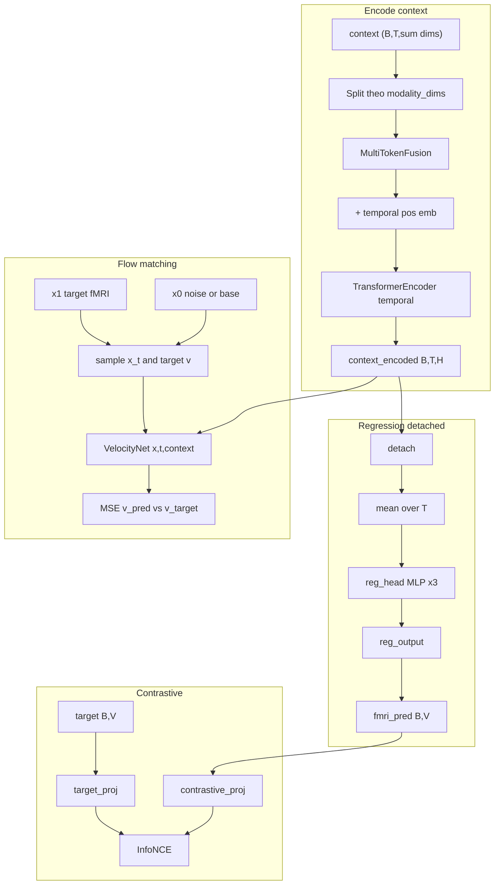

# Tài liệu kiến trúc BrainFlow (Direct v3)

Nguồn chính: [`src/train_brainflow.py`](../src/train_brainflow.py) (dữ liệu + vòng lặp huấn luyện), [`src/models/brainflow/brainflow.py`](../src/models/brainflow/brainflow.py) (mô hình), [`src/configs/brainflow.yaml`](../src/configs/brainflow.yaml) (siêu tham số).

---

## 1. Tóm tắt ý tưởng

**BrainFlow** dự đoán vector fMRI (V voxel, ví dụ 1000) từ **chuỗi ngữ cảnh đa phương thức** đã được trích đặc trưng trước `(B, T, Σ dim_m)`. Huấn luyện kết hợp:

- **Flow matching (OT-CFM)** hoặc tùy chọn **Tensor FM** (lịch trình nội suy theo từng chiều qua tham số `gamma`).
- **Hồi quy phụ (MSE)** trên fMRI để có tín hiệu trực tiếp; encoder dùng chung nhưng nhánh reg **detach** để tránh kéo encoder theo hướng xung đột với flow.
- **Contrastive (InfoNCE hai chiều)** giữa embedding của `fmri_pred` (từ reg) và `target` trong không gian chiếu.
- **Suy luận**: giải ODE từ `x_init` (noise / zeros / phân phối từ mô hình cơ sở) đến `t=1`, tùy chọn **CFG** (velocity có điều kiện vs không điều kiện).

---

## 2. Các module trong `brainflow.py` (theo thứ tự phụ thuộc)

| Module / hàm | Vai trò |
|----------------|---------|
| `tensor_warp_schedule`, `TimeWarpNet` | (Tensor FM) Dự đoán `gamma` từ context đã pool; `lambda(t)`, `lambda'(t)` cho nội suy per-dim giữa `x_0` và `x_1`. |
| `SinusoidalPosEmb` | Embedding thời gian liên tục `t ∈ [0,1]` (kiểu diffusion). |
| `SubjectLayers` | Định nghĩa trong file nhưng **không được dùng** trong `VelocityNet` hiện tại; đầu ra velocity là `Linear(hidden_dim, output_dim)`. Subject được đưa vào qua `nn.Embedding` trong nhánh embedding thời gian (`t_emb += subject_emb(subject_ids)`). |
| `MultiTokenFusion` | Tách context theo `modality_dims` → projector + LayerNorm + GELU từng modality → cộng `modality_emb` → (train) modality dropout (giữ ít nhất 1 modality) → **mean** theo modality → `output_proj`. Ra `(B, T, hidden_dim)`. |
| `SimpleFiLMBlock` | FiLM (scale/shift) từ `t_emb` lên hidden đã norm → FFN residual → cross-attn (Q: hidden 1 token, KV: toàn bộ chuỗi context). |
| `VelocityNet` | `encode_context_from_cond`: split concat → `MultiTokenFusion` → `+ context_pos_emb` → `TransformerEncoder` (temporal) → `LayerNorm`. `forward`: `input_proj(x)` + các `SimpleFiLMBlock` + `Linear` → velocity `(B, V)`. |
| `info_nce_loss` | InfoNCE hai chiều (pred↔target) trên ma trận similarity L2-normalized. |
| `BrainFlow` | Gộp `VelocityNet`, optional `TimeWarpNet`, `reg_head` + `reg_output`, `contrastive_proj` / `target_proj`, `AffineProbPath(CondOTScheduler)`; `compute_loss`, `synthesise`. |

**Lưu ý docstring**: `VelocityNet` vẫn ghi "LinearFusion" nhưng implementation là **MultiTokenFusion** (NSD-style).

---

## 3. Sắp xếp layer và luồng dữ liệu



**VelocityNet bên trong một bước `t`:**

- Input: `x_t` `(B,V)` → Linear+GELU → `h` `(B,H)`.
- `t_emb = time_mlp(SinusoidalPosEmb(t)) + subject_emb(subject_ids)`.
- Lặp `n_blocks` × `SimpleFiLMBlock`: FiLM+FFN trên `h`, rồi cross-attn `h` với `context_encoded`.

---

## 4. Vai trò của `train_brainflow.py`

- **`DirectFlowDataset`**: Preload H5 fMRI + nhiều thư mục `.npy` context; ghép modality theo trục feature; cửa sổ `feat_seq_len = feature_context_trs + 1` căn `hrf_delay`, padding đầu nếu thiếu; tùy chọn chuẩn hóa fMRI theo `global_mean/std`.
- **`ClipGroupedBatchSampler`**: Gom mẫu cùng clip để batch đồng nhất clip hơn.
- **`_get_base_prediction` + `base_model` (Residual FM)**: Cắt context thành phần trùng modality với mô hình cơ sở → encode → `reg_head` → `reg_output` làm `starting_distribution`; phần context còn lại đi vào mô hình residual.
- Huấn luyện: 10% batch **zero context** (tương thích CFG); `compute_loss`; EMA; validation: `synthesise` + gom PCC theo clip/TR; checkpoint `best.pt` / `last.pt`.

**Lưu ý triển khai**: `use_tensor_fm` chỉ thay đổi **cách lấy mẫu và mục tiêu velocity trong `compute_loss`**. Hàm `synthesise` khi không dùng CFG gọi `ODESolver` chung — không nhánh riêng cho Tensor FM trong inference (cần ghi nhận khi bật `tensor_fm` trong config).

---

## 5. Mã giả thuật toán

### 5.1 Encode context

```
function EncodeContext(cond):  // cond: (B, T, D_total)
  splits ← split(cond, modality_dims)
  for each modality m:
    h_m ← GELU(LayerNorm(Linear(splits[m])))
    h_m ← h_m + modality_emb[m]
  optionally zero some modalities (training), keep ≥1
  x ← mean_m(h_m)                    // (B, T, H)
  x ← output_proj(x)
  x ← x + context_pos_emb[:, :T]
  x ← TemporalTransformerEncoder(x)
  return LayerNorm(x)                // context_encoded
```

### 5.2 `compute_loss` (tóm tắt)

```
function ComputeLoss(context, target, subject_ids, starting_distribution?):
  Z ← EncodeContext(context)                    // có gradient về fusion + temporal encoder

  // Hồi quy + TimeWarpNet dùng cùng một vector pool đã detach — không gradient về encoder
  z_pool ← mean_t(Z.detach())

  fmri_pred ← reg_output(reg_head(z_pool))
  L_reg ← MSE(fmri_pred, target)

  z_p ← normalize(contrastive_proj(fmri_pred))
  z_t ← normalize(target_proj(target))
  L_cont ← InfoNCE_bidirectional(z_p, z_t)

  x_1 ← target
  x_0 ← starting_distribution if given else Normal(0, I)

  t ← Uniform(0,1) per sample

  if tensor_fm:
    gamma ← TimeWarpNet(z_pool)                 // z_pool đã detach → không cập nhật encoder
    lambda_t, dlambda ← tensor_warp_schedule(gamma, t)
    x_t ← lambda_t * x_1 + (1 - lambda_t) * x_0
    v_star ← dlambda * (x_1 - x_0)
    L_gamma ← mean(gamma^2)                     // regularization
  else:
    (x_t, v_star) ← AffineProbPath.sample(t, x_0, x_1)   // OT-CFM
    L_gamma ← 0

  v_pred ← VelocityNet(x_t, t, pre_encoded=Z, subject_ids)
  L_flow ← MSE(v_pred, v_star)

  L_total ← L_flow
            + reg_weight * L_reg
            + cont_weight * L_cont
            + gamma_reg_weight * L_gamma

  return { total: L_total, flow: L_flow, reg: L_reg, cont: L_cont, gamma_reg: L_gamma }
```

### 5.3 `synthesise` (không CFG)

```
function Synthesise(context, n_steps, subject_ids, starting_distribution?, temperature):
  Z ← EncodeContext(context)
  if starting_distribution:
    x ← starting_distribution
  else if temperature > 0:
    x ← temperature * Normal(0, I)
  else:
    x ← 0

  T ← linspace(0, 1, n_steps)
  x ← ODESolver.integrate(
        velocity = (x, t) -> VelocityNet(x, t, pre_encoded=Z, subject_ids),
        x_init = x,
        time_grid = T,
        method = midpoint | euler,
        ...
      )
  return x
```

### 5.4 `synthesise` (có CFG)

```
function Synthesise_CFG(context, n_steps, subject_ids, cfg_scale, ...):
  Z_cond ← EncodeContext(context)
  Z_uncond ← EncodeContext(zeros_like(context))
  x ← x_init  // như nhánh không CFG
  T ← linspace(0, 1, n_steps)
  dt ← 1 / (n_steps - 1)
  for i in 0 .. n_steps - 2:
    t ← T[i]
    v_c ← VelocityNet(x, t, Z_cond, subject_ids)
    v_u ← VelocityNet(x, t, Z_uncond, subject_ids)
    v ← v_u + cfg_scale * (v_c - v_u)
    x ← x + dt * v
  return x
```

---

## 6. Siêu tham số điển hình (từ config)

- `brainflow.reg_weight`, `cont_weight`, `cont_dim`; `velocity_net`: `hidden_dim`, `n_blocks=4`, `temporal_attn_layers=2`, `modality_dropout`, `max_seq_len`.
- Tùy chọn `brainflow.tensor_fm` (khi bật): `TimeWarpNet` + `gamma_reg_weight`.
- `solver_args`: `time_points`, `method`, `cfg_scale`, `temperature`.

---

## 7. Tài liệu tham khảo trong repo

- Cấu hình mẫu: [`src/configs/brainflow.yaml`](../src/configs/brainflow.yaml), [`src/configs/brainflow_residual.yaml`](../src/configs/brainflow_residual.yaml) (Residual FM + `base_model`).
- Đánh giá: [`src/evaluate_brainflow.py`](../src/evaluate_brainflow.py).
