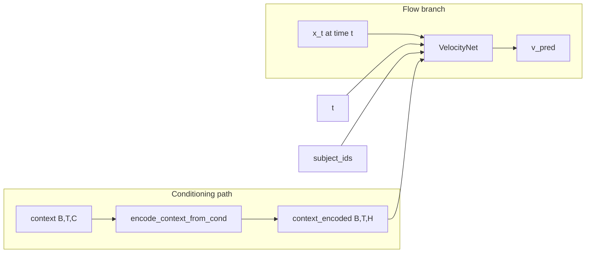

# BrainFlow: Start Distribution, Conditioning, VelocityNet

Conceptual reference for [`src/models/brainflow/brainflow.py`](../src/models/brainflow/brainflow.py) and [`src/train_brainflow.py`](../src/train_brainflow.py).

## 1. Start distribution (`x_0` / `starting_distribution`)

In **conditional OT flow matching**, each training pair uses endpoints `x_0` (source) and `x_1` (data target). The affine path is \(X_t = (1-t)x_0 + t x_1\) with target velocity \(x_1 - x_0\).

### Training (`BrainFlow.compute_loss`)

- If `starting_distribution` is **None**: `x_0 = torch.randn_like(x_1)` — i.i.d. Gaussian noise (standard FM source).
- If `starting_distribution` is set (Residual FM): `x_0` is that tensor — typically the **frozen base model’s regression output** (a deterministic vector per sample; the name reflects where the flow starts in sample space).

### Inference (`BrainFlow.synthesise`)

- If `starting_distribution` is **None**: `x_init = 0` (zeros), not random Gaussian — a **deterministic** start (approximate mean of the Gaussian source used at train time).
- If Residual FM: `x_init = starting_distribution` so the ODE starts from the base model prediction, aligned with training `x_0`.

**Summary:** “Start distribution” in code means the **concrete `x_0` sample** on the OT segment; default training uses **noise**, default inference uses **zeros** unless Residual FM passes the base prediction.

## 2. Conditioning mechanism

Conditioning is **multimodal temporal context** plus **subject** and optional **CFG**.

| Mechanism | Role |
|-----------|------|
| **Context tensor** `(B, T, C)` | Pre-extracted stimulus features (modalities concatenated on `C`). Encoded by `VelocityNet.encode_context_from_cond`: `MultiTokenFusion` → temporal self-attention → `context_encoded` `(B, T, hidden)`. |
| **Cross-attention in `SimpleFiLMBlock`** | Query = current hidden state `x_t`; key/value = `context_encoded`. Injects condition into the velocity at each block. |
| **Time `t`** | Sinusoidal embedding + MLP; **FiLM** (scale/shift) on the hidden state. |
| **`subject_ids`** | Added to time embedding. The velocity head is a **`Linear(hidden_dim, output_dim)`** (`output_layer`). (`SubjectLayers` exists in the same module but is not used by this `VelocityNet`.) |
| **Auxiliary regression** | `context_encoded.detach()` → mean pool → MLP → MSE to `target` — no gradient into the fusion encoder (stabilizes training). |
| **Contrastive** | InfoNCE between projected reg prediction and projected target. |
| **CFG (train)** | In `train_brainflow.py`: 10% of steps use **zero context** (classifier-free style). |
| **CFG (inference)** | If `cfg_scale > 0`: `v = v_uncond + cfg_scale * (v_cond - v_uncond)` with uncond = encoded **zero** context. |
| **Residual FM** | Frozen base model produces `starting_distribution` from **first N modalities**; the trainable model receives only **remaining** context channels. Helper: `_get_base_prediction` in `train_brainflow.py`. |

## 3. Velocity net (`VelocityNet`)

**Role:** Implements **u_θ(x, t | context, subject)** — the vector field whose MSE against `x_1 - x_0` is the flow-matching loss.

**Structure:**

1. **Encode condition:** Split `cond` by `modality_dims` → `MultiTokenFusion` (per-modality linear + modality embedding, mean over modalities) → temporal positional embedding → **TransformerEncoder** (temporal self-attention).
2. **State:** `x_t` (fMRI-sized) → `input_proj` → hidden `(B, hidden_dim)`.
3. **Time:** `SinusoidalPosEmb` → `time_mlp` + `subject_emb(subject_ids)`.
4. **Stack:** Several **`SimpleFiLMBlock`**: FiLM from time emb, FFN, **cross-attention** (Q from hidden, KV from `context_encoded`).
5. **Output:** `final_norm` → `Linear(hidden_dim, output_dim)` → predicted velocity.

The velocity net is a **conditional vector field**: it maps **(intermediate brain state, time)** to a **velocity in fMRI space**, conditioned on the **encoded stimulus sequence** and **subject**.

## Code pointers

| Topic | Location |
|-------|----------|
| FM loss, `x_0`, path sampling | `BrainFlow.compute_loss` in `brainflow.py` |
| `synthesise`, `x_init`, CFG | `BrainFlow.synthesise` in `brainflow.py` |
| Residual base → `starting_distribution` | `_get_base_prediction` in `train_brainflow.py` |
